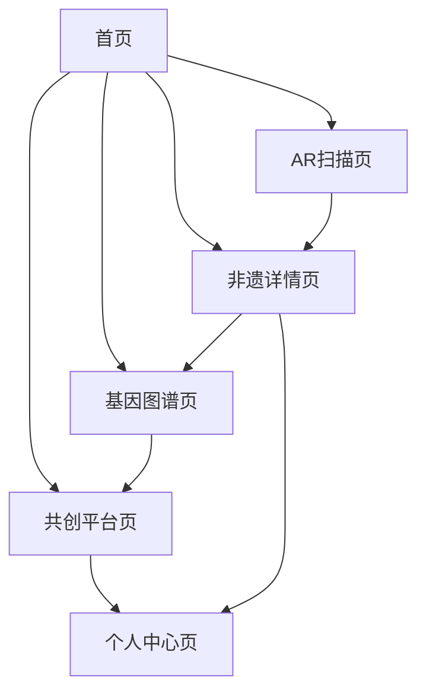

## 1. 产品概述
「年味基因库」是一个创新的非遗年俗互动百科平台，通过AR技术和知识图谱将200+项国家级春节非遗技艺数字化。用户可以探索年俗制作流程、历史脉络和传承人故事，同时通过AR扫描家中年俗物品解锁3D制作过程，获得个性化的年味基因报告，并参与非遗文化的共创传承。

产品致力于解决传统文化传播形式单一、年轻群体参与度低的问题，让非遗文化以互动化、数字化的方式走进现代生活。

## 2. 核心功能

### 2.1 用户角色
| 角色 | 注册方式 | 核心权限 |
|------|----------|----------|
| 普通用户 | 手机号/微信注册 | 浏览非遗内容、使用AR扫描、生成基因图谱、上传年俗 |
| 审核员 | 内部授权 | 审核用户上传内容、管理非遗数据 |
| 传承人 | 官方认证 | 发布技艺教程、管理个人作品、与用户互动 |

### 2.2 功能模块
我们的非遗年俗互动百科包含以下核心页面：

1. **首页**：非遗技艺展示、AR扫描入口、个性化推荐
2. **AR扫描页**：实时扫描识别、3D制作过程展示
3. **基因图谱页**：个人年味基因报告、文化DNA分析
4. **非遗详情页**：技艺介绍、历史脉络、传承人故事
5. **共创平台页**：用户上传、作品展示、社区互动
6. **个人中心页**：收藏管理、基因报告历史、上传记录

### 2.3 页面详情
| 页面名称 | 模块名称 | 功能描述 |
|----------|----------|----------|
| 首页 | 非遗技艺轮播 | 展示精选非遗项目，支持3D模型预览 |
| 首页 | AR扫描入口 | 一键进入AR扫描模式，识别年俗物品 |
| 首页 | 个性化推荐 | 基于用户基因图谱推荐相关非遗内容 |
| AR扫描页 | 相机权限申请 | 获取用户相机使用权限 |
| AR扫描页 | 实时识别 | 识别春联、窗花、灯笼等年俗物品 |
| AR扫描页 | 3D过程展示 | 叠加显示制作流程的3D动画 |
| AR扫描页 | 互动操作 | 支持暂停、重播、缩放等操作 |
| 基因图谱页 | 数据采集 | 收集用户家乡、年龄、兴趣信息 |
| 基因图谱页 | 算法分析 | 分析用户文化背景和偏好 |
| 基因图谱页 | 基因报告生成 | 生成可视化年味基因图谱 |
| 基因图谱页 | 分享功能 | 支持报告分享到社交媒体 |
| 非遗详情页 | 技艺介绍 | 详细的制作步骤和工艺说明 |
| 非遗详情页 | 历史脉络 | 时间轴展示技艺传承历史 |
| 非遗详情页 | 传承人故事 | 传承人简介、作品展示 |
| 非遗详情页 | 3D模型展示 | 可交互的3D技艺模型 |
| 共创平台页 | 上传功能 | 支持图片、视频、文字上传 |
| 共创平台页 | 审核状态 | 显示上传内容的审核进度 |
| 共创平台页 | 社区互动 | 点赞、评论、分享功能 |
| 个人中心页 | 收藏管理 | 管理收藏的非遗项目 |
| 个人中心页 | 基因历史 | 查看历史基因报告 |
| 个人中心页 | 上传记录 | 管理个人上传的年俗内容 |

## 3. 核心流程

### 普通用户流程
用户进入首页后可以浏览推荐的非遗技艺，点击AR扫描按钮进入扫描模式。对准家中的年俗物品（如春联、窗花），系统自动识别并展示对应的3D制作过程。用户可以在非遗详情页深入了解技艺的历史和传承。在基因图谱页面，用户填写个人信息后获得专属的文化基因报告。发现独特的年俗时，用户可以通过共创平台上传分享。

### 审核员流程
审核员登录后可以查看待审核的用户上传内容，包括图片、视频和文字描述。审核通过的内容将被添加到非遗基因库中，不通过的内容会附上审核意见反馈给用户。

## 4. 用户界面设计

### 4.1 设计风格
- **主色调**：中国红 (#DC143C) 配金色 (#FFD700) 点缀
- **辅助色**：深褐色 (#8B4513) 和米白色 (#FAF0E6)
- **按钮样式**：圆角矩形，悬停时有轻微阴影效果
- **字体**：标题使用思源黑体，正文使用苹方字体
- **布局风格**：卡片式布局，突出视觉层次
- **图标风格**：扁平化设计，融入传统纹样元素

### 4.2 页面设计概述
| 页面名称 | 模块名称 | UI元素 |
|----------|----------|--------|
| 首页 | 非遗技艺轮播 | 全屏3D模型展示，自动旋转，支持手势缩放，背景渐变红色 |
| 首页 | AR扫描入口 | 悬浮按钮，红色圆形配扫描图标，点击后有波纹动画 |
| AR扫描页 | 实时识别 | 全屏相机视图，识别框为金色虚线，成功时显示绿色勾号 |
| AR扫描页 | 3D过程展示 | 半透明教程面板，可拖拽的3D模型，支持多角度观看 |
| 基因图谱页 | 基因报告 | 圆形基因图谱，不同颜色代表不同文化元素，支持点击查看详情 |
| 非遗详情页 | 3D模型展示 | 占据页面三分之二空间，支持360度旋转，配有音效 |

### 4.3 响应式设计
采用桌面端优先的设计策略，确保在大屏幕上能够充分展示3D模型和复杂的基因图谱。移动端适配时采用响应式布局，简化交互元素，优化触摸操作体验。AR功能在移动端提供最佳体验，支持陀螺仪和手势识别。

### 4.4 3D场景指导
- **环境设置**：使用温暖的工作室HDRI环境，营造传统手工艺氛围
- **光照配置**：主光源为暖色调，强度0.8，提供柔和阴影；补光强度0.3，冷色调平衡；轮廓光强度0.5，突出模型边缘
- **相机控制**：默认FOV 45度，支持轨道控制，限制垂直旋转角度在-90到90度之间
- **交互设计**：悬停时模型轻微发光，点击触发制作动画，支持多点触控缩放
- **后期处理**：启用轻微辉光效果增强视觉冲击力，使用环境遮蔽增加深度感
- **性能优化**：模型多边形数控制在5000面以内，纹理贴图不超过1024x1024分辨率