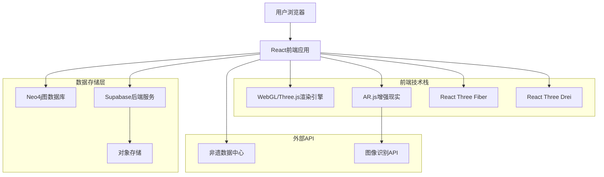
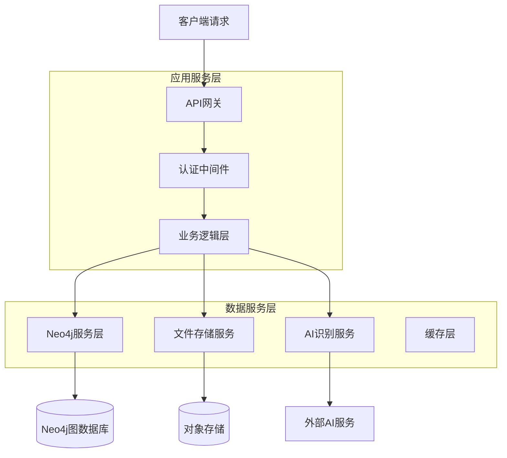
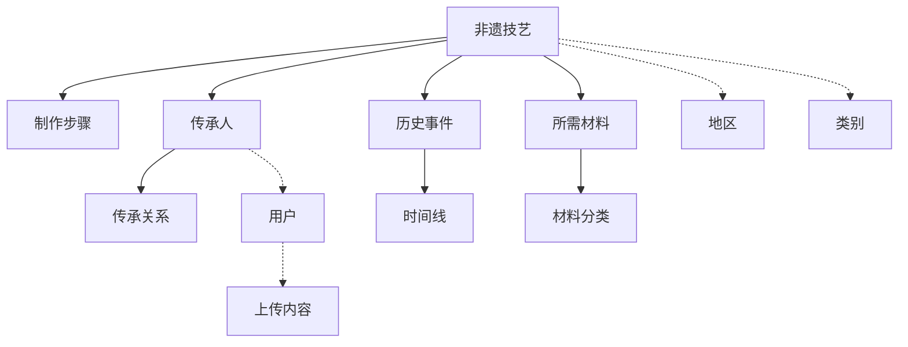

## 1. 架构设计



## 2. 技术描述

- **前端框架**：React@18 + TypeScript + Vite
- **3D渲染**：Three.js@0.158 + @react-three/fiber@8.15 + @react-three/drei@9.88
- **AR功能**：AR.js@3.4 + WebXR API
- **状态管理**：Zustand@4.4
- **UI组件**：Ant Design@5.12 + TailwindCSS@3.3
- **图表可视化**：D3.js@7.8 + ECharts@5.4
- **后端服务**：Supabase@2.38 (认证+存储)
- **图数据库**：Neo4j@5.15 + @neo4j/graphql@4.6
- **初始化工具**：vite-init

## 3. 路由定义

| 路由 | 用途 |
|-------|---------|
| / | 首页，展示非遗技艺推荐和AR入口 |
| /ar-scan | AR扫描页面，实时识别年俗物品 |
| /heritage/:id | 非遗详情页，展示技艺详情和3D模型 |
| /gene-profile | 基因图谱页面，生成个人文化基因报告 |
| /co-creation | 共创平台，用户上传和分享年俗 |
| /profile | 个人中心，管理收藏和上传记录 |
| /login | 登录页面，支持手机号和微信登录 |
| /admin/review | 审核后台，管理用户上传内容 |

## 4. API定义

### 4.1 非遗数据API

```
GET /api/heritage/list
```

请求参数：
| 参数名 | 类型 | 必需 | 描述 |
|--------|------|------|------|
| category | string | false | 技艺类别筛选 |
| region | string | false | 地区筛选 |
| page | number | true | 页码 |
| limit | number | true | 每页数量 |

响应：
```json
{
  "data": [
    {
      "id": "heritage_001",
      "name": "剪纸技艺",
      "category": "传统美术",
      "region": "陕西",
      "difficulty": 3,
      "3dModel": "paper_cutting.glb",
      "arMarker": "marker_001.patt"
    }
  ],
  "total": 200,
  "page": 1
}
```

### 4.2 AR识别API

```
POST /api/ar/recognize
```

请求：
| 参数名 | 类型 | 必需 | 描述 |
|--------|------|------|------|
| image | string | true | Base64编码的图像数据 |
| type | string | true | 识别类型：marker/image |

响应：
```json
{
  "recognized": true,
  "heritageId": "heritage_001",
  "confidence": 0.95,
  "tutorialSteps": [
    {
      "step": 1,
      "description": "准备红纸和剪刀",
      "duration": 3000
    }
  ]
}
```

### 4.3 基因图谱API

```
POST /api/gene-profile/generate
```

请求：
| 参数名 | 类型 | 必需 | 描述 |
|--------|------|------|------|
| hometown | string | true | 用户家乡 |
| age | number | true | 用户年龄 |
| interests | array | true | 兴趣标签数组 |
| familyTraditions | array | false | 家庭传统描述 |

响应：
```json
{
  "profileId": "gene_001",
  "geneMap": {
    "culturalElements": [
      {
        "type": "food",
        "strength": 0.8,
        "heritages": ["dumpling_making", "rice_cake"]
      }
    ],
    "regionalScore": 0.75,
    "generationGap": 0.3
  },
  "recommendations": ["heritage_001", "heritage_002"]
}
```

## 5. 服务器架构



## 6. 数据模型

### 6.1 Neo4j图数据库设计



### 6.2 核心节点和关系定义

**非遗技艺节点 (Heritage)**
```cypher
CREATE (h:Heritage {
  id: 'heritage_001',
  name: '剪纸技艺',
  category: '传统美术',
  region: '陕西',
  difficultyLevel: 3,
  culturalValue: '国家级',
  createdAt: datetime(),
  updatedAt: datetime()
})
```

**传承人节点 (Inheritor)**
```cypher
CREATE (i:Inheritor {
  id: 'inheritor_001',
  name: '张师傅',
  birthYear: 1950,
  experience: 40,
  level: '国家级代表性传承人',
  studio: '张氏剪纸工作室'
})
```

**用户节点 (User)**
```cypher
CREATE (u:User {
  id: 'user_001',
  phone: '+86xxxxxxxxxxx',
  hometown: '陕西省西安市',
  birthYear: 1990,
  interests: ['传统美术', '民俗文化'],
  geneProfile: 'gene_001'
})
```

**关系定义**
```cypher
// 传承关系
MATCH (i:Inheritor), (h:Heritage)
WHERE i.id = 'inheritor_001' AND h.id = 'heritage_001'
CREATE (i)-[:INHERITS {
  startYear: 1980,
  masteryLevel: '精通',
  teachingStatus: '收徒传承'
}]->(h)

// 用户收藏关系
MATCH (u:User), (h:Heritage)
WHERE u.id = 'user_001' AND h.id = 'heritage_001'
CREATE (u)-[:COLLECTED {
  collectedAt: datetime(),
  interactionCount: 5
}]->(h)

// 地区关系
MATCH (h:Heritage), (r:Region)
WHERE h.id = 'heritage_001' AND r.name = '陕西'
CREATE (h)-[:ORIGINATES_FROM]->(r)
```

### 6.3 Supabase表结构

**用户表 (users)**
```sql
CREATE TABLE users (
  id UUID PRIMARY KEY DEFAULT gen_random_uuid(),
  phone VARCHAR(20) UNIQUE NOT NULL,
  email VARCHAR(255),
  name VARCHAR(100),
  avatar_url TEXT,
  hometown VARCHAR(100),
  birth_year INTEGER,
  gene_profile JSONB,
  role VARCHAR(20) DEFAULT 'user' CHECK (role IN ('user', 'inheritor', 'admin')),
  created_at TIMESTAMP WITH TIME ZONE DEFAULT NOW(),
  updated_at TIMESTAMP WITH TIME ZONE DEFAULT NOW()
);

-- 创建索引
CREATE INDEX idx_users_phone ON users(phone);
CREATE INDEX idx_users_gene_profile ON users USING GIN(gene_profile);
```

**用户上传内容表 (user_contributions)**
```sql
CREATE TABLE user_contributions (
  id UUID PRIMARY KEY DEFAULT gen_random_uuid(),
  user_id UUID REFERENCES users(id) ON DELETE CASCADE,
  title VARCHAR(200) NOT NULL,
  description TEXT,
  images TEXT[], -- 存储图片URL数组
  video_url TEXT,
  category VARCHAR(50),
  region VARCHAR(50),
  status VARCHAR(20) DEFAULT 'pending' CHECK (status IN ('pending', 'approved', 'rejected')),
  reviewer_id UUID REFERENCES users(id),
  review_note TEXT,
  created_at TIMESTAMP WITH TIME ZONE DEFAULT NOW(),
  reviewed_at TIMESTAMP WITH TIME ZONE
);

-- 创建索引
CREATE INDEX idx_contributions_user_id ON user_contributions(user_id);
CREATE INDEX idx_contributions_status ON user_contributions(status);
CREATE INDEX idx_contributions_created_at ON user_contributions(created_at DESC);
```

**访问权限设置**
```sql
-- 用户上传内容权限
GRANT SELECT ON user_contributions TO anon;
GRANT ALL ON user_contributions TO authenticated;

-- 创建行级安全策略
ALTER TABLE user_contributions ENABLE ROW LEVEL SECURITY;

-- 用户只能查看自己的待审核内容
CREATE POLICY user_view_own_pending ON user_contributions
  FOR SELECT TO authenticated
  USING (auth.uid() = user_id OR status != 'pending');

-- 审核员可以查看和更新所有内容
CREATE POLICY admin_manage_all ON user_contributions
  FOR ALL TO authenticated
  USING (EXISTS (
    SELECT 1 FROM users 
    WHERE id = auth.uid() AND role = 'admin'
  ));
```

## 7. 性能优化策略

### 7.1 3D模型优化
- 使用Draco压缩减少GLB文件大小
- 实施LOD（细节层次）技术，根据距离加载不同精度的模型
- 纹理贴图采用KTX2格式，支持GPU压缩

### 7.2 AR识别优化
- 使用Web Workers进行图像处理，避免阻塞主线程
- 实施缓存策略，已识别的标记直接加载本地数据
- 采用机器学习模型预加载，提升识别准确率

### 7.3 知识图谱查询优化
- 为常用查询路径创建索引
- 实施查询结果缓存，减少数据库访问
- 使用图形算法预计算相关推荐